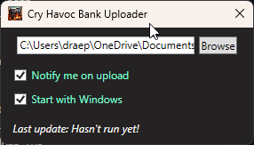

# Cry Havoc gbank Uploader

Monitors CryHavocBank.lua saved variables field and uploads to the guild API.



## Prerequisites

You must have the addon installed which will dump the bank data to a file when you open it. If you do not have permissions to view all tabs, your data might be incomplete.

## Installation

No installation, just download the application version that you want:

- Portable: Larger because it contains the required framework to run
- Dotnet: Much smaller but requires .NET 8 to be installed. It will prompt you to install it and direct you to the download page if you do not have it.

### API Key

Obtain API key an set in your local environment:

1. Press control-R and type cmd, then hit enter to open command terminal
1. Run the following command to set the API key, replacing `<your key>` with the actual key

```cmd
> setx CH_API_KEY "<your key>"
```

Run the exe file. You can choose to have the application start with windows so that you don't have to remember.

## Other Notes

- Config file is stored at `%LOCALAPPDATA%\GbankUploader\user_settings.json`
- When the gbank is opened in-game, it will dump the file to memory but it won't be written to the file until you /reload or exit, so the uploader won't detect it right away.
- Once the data is uploaded, the gbank will be searchable in discord using `/gbank <item name>`
